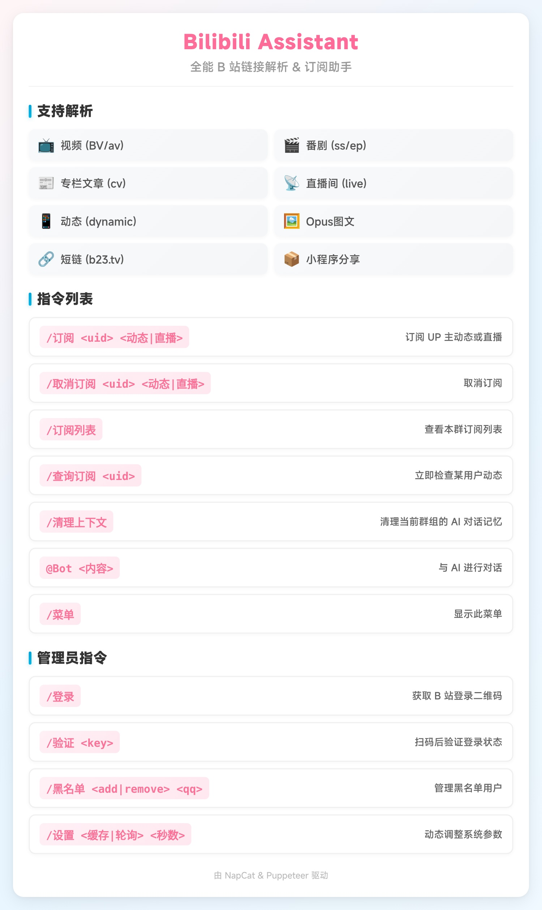

# Bili QQ Bot

   

基于 [NapCat](https://github.com/NapNeko/NapCatQQ) 框架开发的 Bilibili 全能助手 QQ 机器人。它能智能识别并解析 B 站几乎所有类型的链接，并为这些内容生成简洁优雅的高清长预览卡片。同时，内置了基于 OpenAI 接口的 AI 智能聊天功能。

## 目录

- [✨ 核心特性](#核心特性)
- [📸 预览效果](#预览效果)
- [⚙️ 配置说明](#配置说明)
- [🚀 快速部署 (Docker)](#快速部署-docker)
- [🛠️ 本地开发 (源码)](#本地开发-源码)
- [💬 指令列表](#指令列表)
- [📂 项目结构](#项目结构)
- [📝 待办计划](#待办计划-roadmap)
- [🙏 致谢](#致谢-acknowledgments)
- [⚠️ 免责声明](#免责声明)

---

## 核心特性

*   🚀 **全类型解析**：精准识别并解析以下内容：
    *   **视频** (BV/av)
    *   **番剧** (ss/ep) - 支持显示评分、追番数、播放量
    *   **专栏文章** (cv) - 支持 2000 字长文摘要抓取
    *   **动态** (t.bilibili.com) - 支持长文、多图、转发动态，**完美还原装扮卡片与粉丝编号**
    *   **用户主页** (space.bilibili.com) - **全新升级**：展示用户获赞/播放/粉丝/关注数据，自动抓取并展示**最新一条动态**内容，支持签名展示与垂直布局。
    *   **Opus 图文** (opus)
    *   **直播间** (live.bilibili.com)
    *   **小程序/短链** (b23.tv) - 自动还原到目标链接（支持 PC 与移动端域名）
*   🖼️ **高颜值预览**：
    *   使用 Puppeteer 生成精美的长截图卡片（推荐搭配 MiSans 字体）。
    *   **智能配色**：自动提取装饰卡片重点色，动态调整粉丝编号文字颜色。
    *   支持 **SVG 矢量图标**，无乱码，视觉统一。
    *   智能布局：自适应单图/多图，自动提取封面颜色背景，类型标签悬浮显示。
*   🤖 **智能 AI 对话**：
    *   支持自定义回复概率 (随机插话) 与 `@机器人` 触发。
    *   支持自定义系统提示词 (System Prompt) 设定人设。
*   📡 **订阅推送**：内置订阅系统，可实时追踪 UP 主动态与直播、番剧更新。
*   🐳 **Docker 化部署**：一键打包部署，默认内置 **MiSans (小米)** 、**Noto CJK (思源)** 与 **Emoji** 字体

## 预览效果

<div align="center">
    
    
    
    
    
    
    
</div>

## 配置说明

本项目采用双重配置系统：`.env` 用于启动/敏感信息，`config.json` 用于运行时动态配置。

### 1. 基础配置 (.env)
复制 `.env.example` 为 `.env`，填入 WebSocket 连接与 AI 密钥等启动参数：

| 变量名 | 说明 | 示例 / 默认值 |
| :--- | :--- | :--- |
| `WS_URL` | NapCat 的 WebSocket 地址 | `ws://localhost:3001` |
| `AI_API_URL` | AI 接口地址 (OpenAI 兼容) | `https://api.openai.com/v1/chat/completions` |
| `AI_API_KEY` | AI 接口密钥 | `sk-xxxxxxxx` |
| `AI_MODEL` | 使用的模型名称 | `gpt-3.5-turbo` |
| `AI_PROBABILITY` | AI 随机插话概率 (0-1) | `0.1` |
| `AI_SYSTEM_PROMPT` | AI 人设提示词 | `你是一个可爱的猫娘...` |
| `PYTHON_PATH` | Python 解释器路径 (本地开发用) | `venv/bin/python` |
| `ADMIN_QQ` | 管理员 QQ 号 (用于特权指令) | `123456789` |
| `USE_BASE64_SEND` | 是否使用 Base64 发送图片 | `false` |

### 2. 动态配置 (config.json)
复制 `config/config.json.example` 为 `config/config.json`。这些配置支持热更新（通过 `/设置` 指令修改）：

| 字段名 | 说明 | 默认值 |
| :--- | :--- | :--- |
| `blacklistedQQs` | 黑名单 QQ 列表 | `[]` |
| `enabledGroups` | 允许响应的群组 (空为全部) | `[]` |
| `linkCacheTimeout` | 链接解析缓存时间 (秒) | `600` |
| `subscriptionCheckInterval` | 订阅轮询间隔 (秒) | `60` |
| `aiContextLimit` | AI 上下文保留条数 | `10` |
| `nightMode` | 深色模式配置 | `{"mode": "off", ...}` |
| `labelConfig` | 标签显示配置 | `{"video": true, ...}` |

## 快速部署 (Docker)

这是最简单、最稳定的部署方式，推荐直接使用线上镜像。

### 1. 前置准备
- 部署并运行 [NapCatQQ](https://github.com/NapNeko/NapCatQQ)，并开启 **正向 WebSocket 服务** (默认端口 3001)
- 准备本项目的配置目录 `config/`，填写 `.env` 与 `config.json`（参考下文配置说明）

### 2. 获取项目
```bash
git clone <repository_url>
cd bili-qq-bot
```

> 建议：如果准备本地打包部署，建议手动下载 **MiSans** 字体文件，并将其放置在项目根目录下的 `fonts/mi/` 文件夹中，以获得最佳的视觉效果。若未提供，将默认使用 Noto CJK 字体。

### 3. 使用线上镜像部署
默认的 `docker-compose.yml` 已配置为线上镜像：
```yaml
services:
  bili-bot:
    image: unsplash/bili-qq-bot:lastest
    container_name: bili-qq-bot
    restart: always
    network_mode: "host"
    volumes:
      - ./config:/app/config
      - ./data:/app/data
      - ./logs:/app/logs
      - ./fonts/custom:/app/fonts/custom
      - /root/napcat-data/QQ:/root/napcat-data/QQ
    environment:
      - TZ=Asia/Shanghai
```
启动：
```bash
docker-compose up -d
docker-compose logs -f
```
> 注意：如果 NapCat 也在 Docker 中运行，`WS_URL` 请填写宿主机 IP 或使用 Docker 网络别名。本项目默认使用 `network_mode: "host"`，因此可以直接使用 `localhost:3001` (Linux 环境)。

### 4. 目录映射 (关键)
为了确保机器人生成的图片能被 NapCat 发送，NapCat 需要能访问图片的临时目录，或通过 Base64 发送：
- 默认：使用 `docker-compose.yml` 中的 `volumes` 映射确保数据与临时目录可访问
- 可选：在 `.env` 中设置 `USE_BASE64_SEND=true`，直接发送 Base64 数据，无需目录映射

### 5. 使用本地打包镜像（可选）
如需本地构建镜像，编辑 `docker-compose.yml`：
1) 注释掉 `image: unsplash/bili-qq-bot`
2) 取消注释 `build: .`
3) 执行：
```bash
docker-compose up -d --build
```
其余配置与日志查看与线上镜像相同。

## npm 运行方法

本项目也支持直接通过 npm 运行。

### 环境要求
- Node.js (v18+)
- Python (v3.8+) 并安装 `bilibili-api-python`（供 `bili_service.py` 调用）
- Chrome/Chromium（Puppeteer 依赖）

### 安装与运行
```bash
# 安装 Node 依赖
npm install

# 配置变量，填入 NapCat 地址和 AI Key 等
cp config/.env.example config/.env
nano config/.env

# 运行
npm start
```
> 提示：如果使用 Python 虚拟环境，请在 `.env` 中设置 `PYTHON_PATH` 指向你的虚拟环境解释器（例如 `venv/bin/python`）。

## 指令列表

所有指令均支持在群聊中直接发送。

### 1. 用户指令 (所有人可用)
| 指令 | 说明 | 示例 |
| :--- | :--- | :--- |
| **B站链接/小程序** | 直接发送链接，Bot 自动回复预览卡片 | `https://www.bilibili.com/video/BV1xx...` |
| `@Bot <内容>` | 与 AI 进行对话 | `@Bot 你好呀` |
| `/菜单` | 查看帮助菜单 | `/菜单` |
| `/订阅列表` | 查看本群订阅列表 | `/订阅列表` |
| `/清理上下文` | 清理当前群组的 AI 对话记忆 | `/清理上下文` |

### 2. 管理指令 (需群管权限)
| 指令 | 说明 | 示例 |
| :--- | :--- | :--- |
| `/查询订阅 <uid>` | 立即检查某用户动态 | `/查询订阅 123456` |
| `/订阅用户 <uid>` | 订阅用户（动态+直播） | `/订阅用户 123456` |
| `/取消订阅用户 <uid>` | 取消用户订阅 | `/取消订阅用户 123456` |
| `/订阅番剧 <season_id>` | 订阅番剧新剧集更新 (支持直接粘贴链接) | `/订阅番剧 https://b23.tv/...` |
| `/取消订阅番剧 <season_id>` | 取消番剧订阅 | `/取消订阅番剧 3068` |
| `/设置 帮助` | 查看详细管理面板 | `/设置 帮助` |
| `/设置 功能 <开\|关>` | 开启/关闭指定群的Bot权限 | `/设置 功能 关` |
| `/设置 黑名单 <添加\|移除\|列表> [qq]` | 管理黑名单 | `/设置 黑名单 添加 123456` |
| `/设置 标签 <分类> <开\|关>` | 开启/关闭指定分类的标签显示 | `/设置 标签 动态 开` |
| `/设置 深色模式 <开\|关\|定时> [时间]` | 配置深色模式 (定时格式: HH:mm-HH:mm) | `/设置 深色模式 定时 21:30-07:30` |
| `/设置 缓存 <秒数>` | 设置链接解析缓存时间 | `/设置 缓存 600` |

### 3. 系统指令 (仅 Root 管理员)
| 指令 | 说明 | 示例 |
| :--- | :--- | :--- |
| `/设置 登录` | 获取 B 站登录二维码 | `/设置 登录` |
| `/设置 验证 <key>` | 扫码后验证登录状态 | `/设置 验证 8a7c...` |
| `/设置 轮询 <秒数>` | 设置订阅轮询间隔 | `/设置 轮询 60` |
| `/设置 管理员 <添加\|移除> <qq>` | 设置本群管理员 (Root 权限下放) | `/设置 管理员 添加 123456` |


## 项目结构

*   `Dockerfile` / `docker-compose.yml`: Docker 部署配置
*   `fonts/custom/`: **自定义字体目录** (放入 .ttf/.otf 文件即可优先使用，支持热更新)
*   `src/bot.js`: 程序入口，WebSocket 连接管理
*   `src/config.js`: 项目配置文件
*   `src/handlers/`: 消息处理逻辑
    *   `messageHandler.js`: 核心路由，正则匹配链接
    *   `aiHandler.js`: AI 对话逻辑
*   `src/services/`: 业务服务
    *   `biliApi.js`: B站API接口封装
    *   `bili_service.py`: Python 中间件，调用 `bilibili-api-python`
    *   `imageGenerator.js`: Puppeteer 绘图与 HTML 渲染
    *   `subscriptionService.js`: 订阅监控服务
*   `src/utils/`: 工具函数
    *   `logger.js`: 日志记录工具

## 待办计划 (Roadmap)

- [ ] ~~**抖音/小红书支持**：扩展解析能力，支持抖音、小红书等平台的链接解析与卡片生成。~~
- [ ] **setup.sh 一键安装脚本**：编辑配置、安装环境、打包镜像、生成 compose、启动并输出日志
- [ ] ~~**动态轮询间隔**：支持根据时间自定义轮询间隔，避免对 B 站 API 压力过大~~
- [ ] **AI记忆支持**：支持存储用户对话记忆，实现上下文对话
- [ ] **图片生成程序解构**：将图片生成逻辑拆分为独立模块，方便维护与扩展
- [x] **自定义字体支持**：优先调用用户配置字体，未配置时使用默认字体

## 致谢 (Acknowledgments)

本项目在开发过程中得到了以下 AI 模型与工具的强力支持：

*   **Qwen**
*   **Gemini**
*   **Claude**
*   **Trae**

## 免责声明

本工具仅用于学习交流，请勿用于非法用途。Bilibili 相关接口由 `bilibili-api-python` 提供，请遵守 B 站相关规定。
