# Bili QQ Bot

   

基于 [NapCat](https://github.com/NapNeko/NapCatQQ) 框架开发的 Bilibili 全能助手 QQ 机器人。它能智能识别并解析 B 站几乎所有类型的链接，并为这些内容生成简洁优雅的高清长预览卡片。同时，内置了基于 OpenAI 接口的 AI 智能聊天功能。

## 目录

- [✨ 核心特性](#核心特性)
- [📸 预览效果](#预览效果)
- [🚀 快速部署 (Docker)](#快速部署-docker)
- [⚙️ 配置说明](#配置说明)
- [💬 指令列表](#指令列表)
- [🛠️ 其他部署方式](#其他部署方式)
- [📂 项目结构](#项目结构)
- [🔧 技术栈](#技术栈)
- [🔒 安全与性能](#安全与性能)
- [📝 待办计划](#待办计划-roadmap)
- [❓ 常见问题](#常见问题-faq)
- [🙏 致谢](#致谢-acknowledgments)
- [⚠️ 免责声明](#免责声明)

---

## 核心特性

*   🚀 **全类型解析**：精准识别并解析以下内容：
    *   **视频** (BV/av) - 完美支持旧版 av 号解析
    *   **番剧** (ss/ep) - 支持显示评分、追番数、播放量
    *   **专栏文章** (cv) - 支持 2000 字长文摘要抓取，**保留富文本格式与插图**
    *   **动态** (t.bilibili.com) - 支持长文、多图、转发动态，**完美还原装扮卡片与粉丝编号**
    *   **用户主页** (space.bilibili.com) - **全新升级**：展示用户获赞/播放/粉丝/关注数据，自动抓取并展示**最新一条动态**内容，支持签名展示与垂直布局。
    *   **Opus 图文** (opus) - **支持富文本解析**，智能识别专栏类型，完美还原图文混排内容
    *   **直播间** (live.bilibili.com)
    *   **小程序/短链** (b23.tv) - 自动还原到目标链接（支持 PC 与移动端域名）
*   ⚡ **性能优化**：
    *   **智能缓存**：自动缓存解析数据到本地 (`data/cache`)，再次解析相同链接时极速响应，减少 API 请求频率。
    *   **LRU 清理机制**：缓存目录自动维护，默认限制 1GB 上限，自动清理久未访问的数据。
*   🎨 **高颜值预览**：
    *   使用 Puppeteer 生成精美的长截图卡片（默认搭配 MiSans 字体）。
    *   **UI 全新升级**：引入**统一设计系统**，支持**定时深色模式**。采用 **毛玻璃** 视觉风格，统一圆角设计与半透明高斯模糊效果，视觉更通透、现代。
    *   **智能配色**：自动提取装饰卡片重点色，动态调整氛围背景与粉丝编号颜色。
    *   **SVG 矢量图标** & **Emoji**，无乱码，视觉统一。
    *   智能布局：自适应单图/多图，自动提取封面颜色背景，类型标签悬浮显示，支持自定义开关。
*   🤖 **智能 AI 对话**：
    *   **群组记忆 (RAG)**：内置向量记忆系统，支持跨越时间的长期记忆。
    *   **上下文感知**：智能维护对话上下文，支持流畅的多轮对话。
    *   **时间感知**：AI 具备精确的时间观念，能理解消息的时间跨度（如“刚才”、“5分钟前”）。
    *   **角色扮演**：支持自定义 System Prompt，可打造专属人设。
    *   **安全增强**：内置 Prompt Injection 防御机制，有效防止越狱。
    *   **支持自定义回复概率 (随机插话) 与 `@机器人` 触发。**
*   📡 **订阅推送**：内置订阅系统，支持**分群订阅**与**分群同步关注分组**，可实时追踪 UP 主动态与直播、番剧更新。
*   🐳 **Docker 化部署**：一键打包部署，默认内置 **MiSans** 、**思源** 与 **Emoji** 字体

## 预览效果

### ☀️ 浅色模式

<table align="center">
  <tr>
    <td align="center">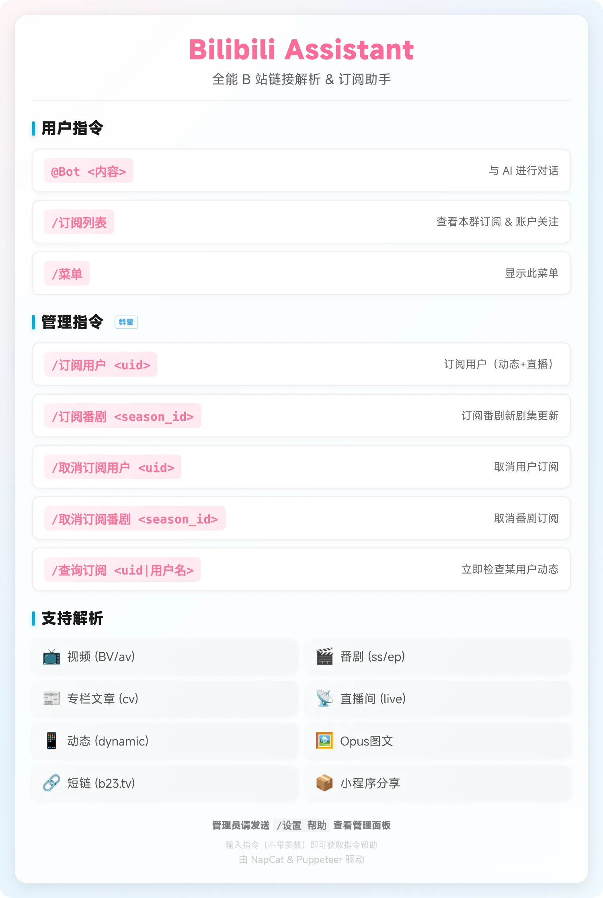<br /><b>帮助菜单</b></td>
    <td align="center">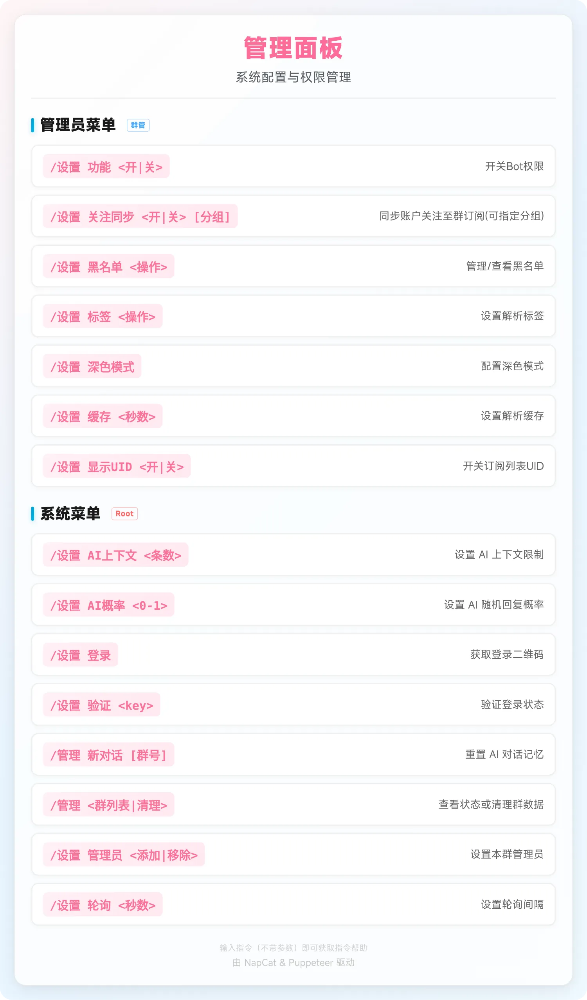<br /><b>管理菜单</b></td>
  </tr>
</table>

<details>
<summary><b>展开查看更多功能预览（视频、动态、用户主页...）</b></summary>
<table align="center">
  <tr>
    <td align="center">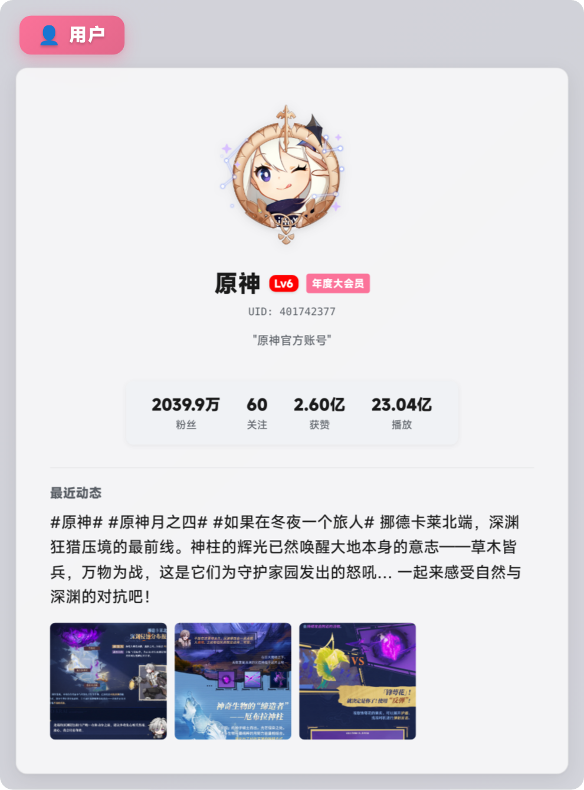<br /><b>用户主页</b></td>
    <td align="center"><br /><b>直播间</b></td>
    <td align="center">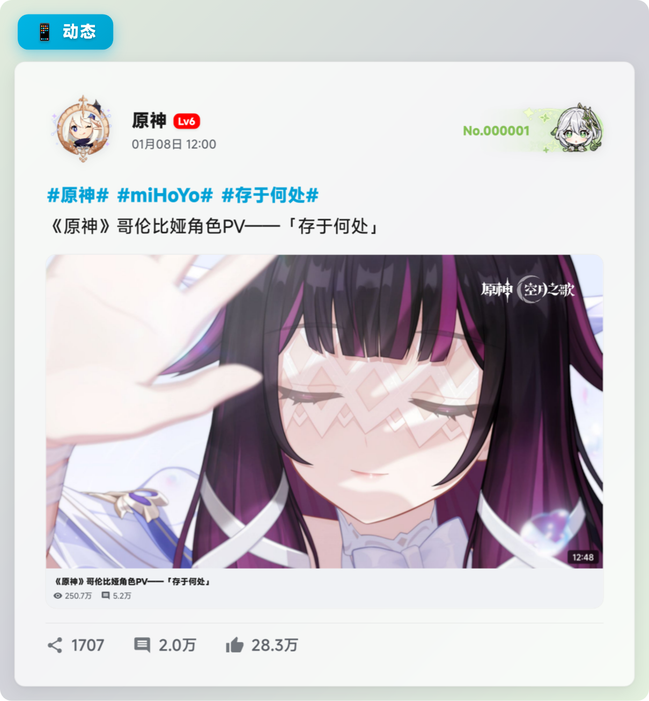<br /><b>视频动态</b></td>
  </tr>
  <tr>
    <td align="center">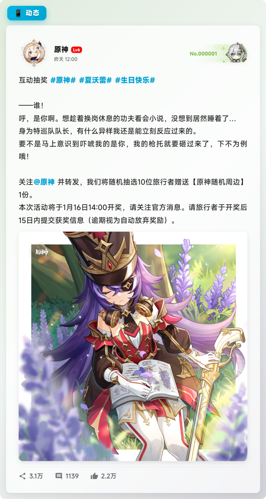<br /><b>动态卡片</b></td>
    <td align="center">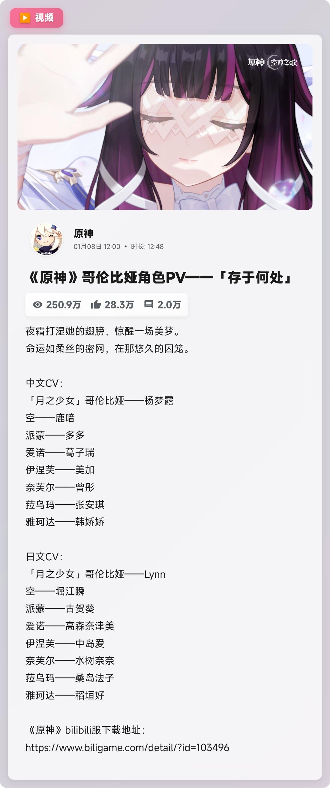<br /><b>视频解析</b></td>
    <td align="center"><br /><b>番剧信息</b></td>
  </tr>
  <tr>
    <td align="center"><br /><b>转发动态</b></td>
    <td align="center">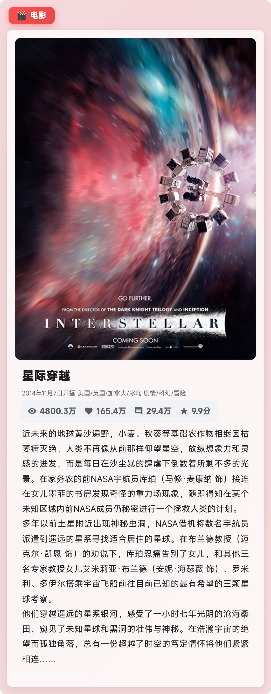<br /><b>电影信息</b></td>
    <td align="center">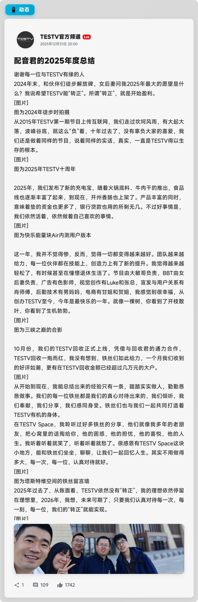<br /><b>Opus专栏</b></td>
  </tr>
</table>
</details>

### 🌙 深色模式
#### *预览图关闭了左上角标签功能*
<table align="center">
  <tr>
    <td align="center">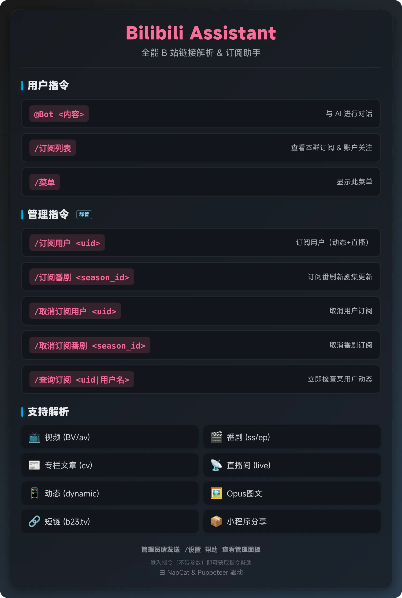<br /><b>帮助菜单</b></td>
    <td align="center">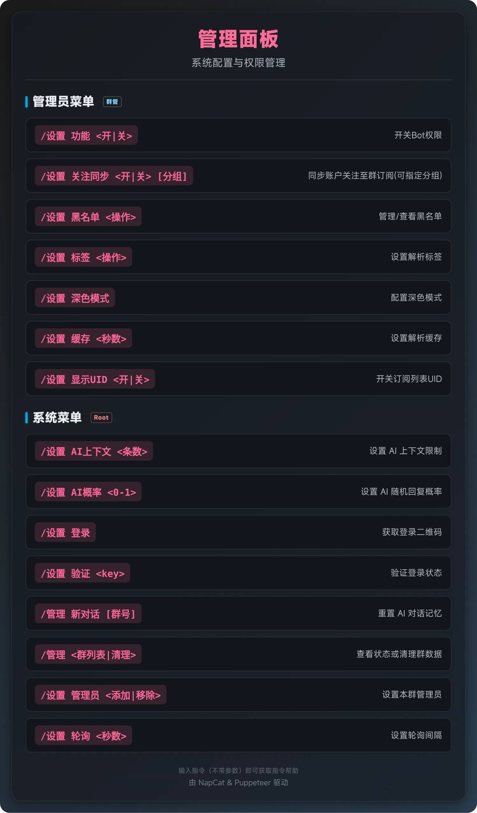<br /><b>管理菜单</b></td>
  </tr>
</table>

<details>
<summary><b>展开查看更多功能预览（视频、动态、用户主页...）</b></summary>
<table align="center">
  <tr>
    <td align="center">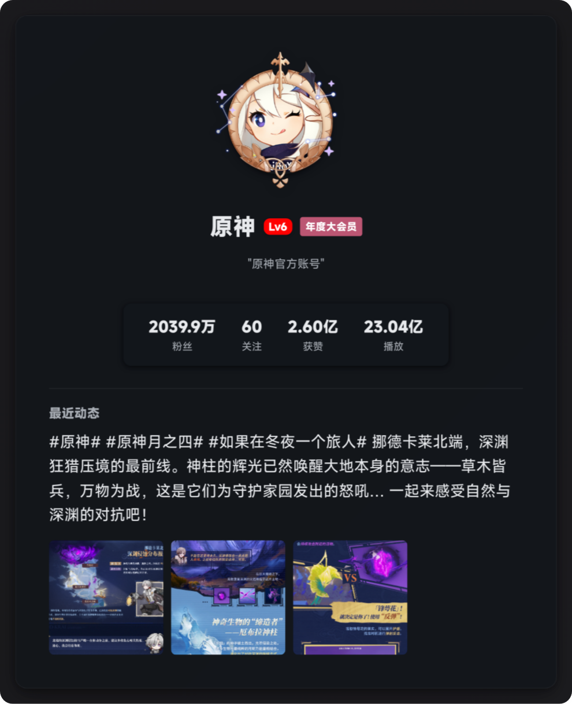<br /><b>用户主页</b></td>
    <td align="center"><br /><b>直播间</b></td>
    <td align="center"><br /><b>视频动态</b></td>
  </tr>
  <tr>
    <td align="center">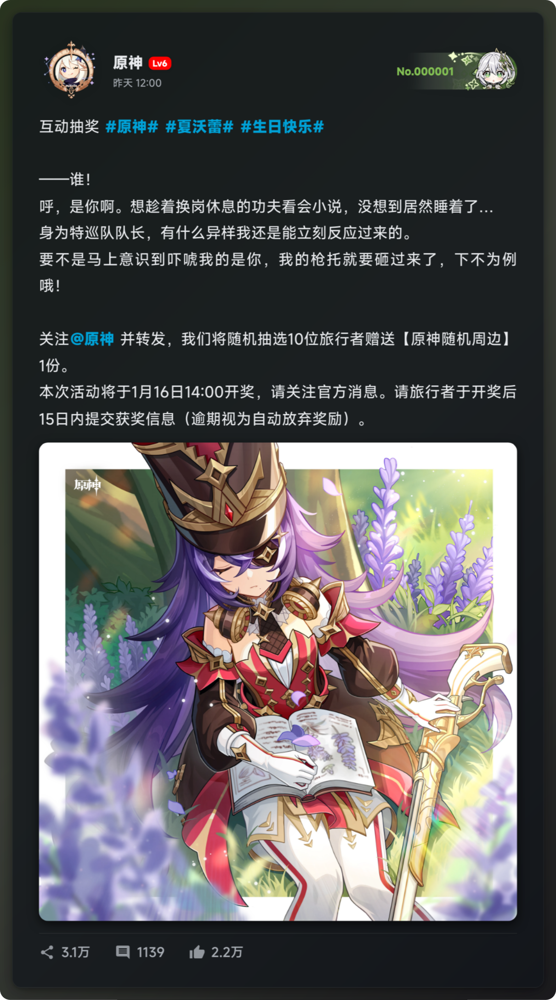<br /><b>动态卡片</b></td>
    <td align="center">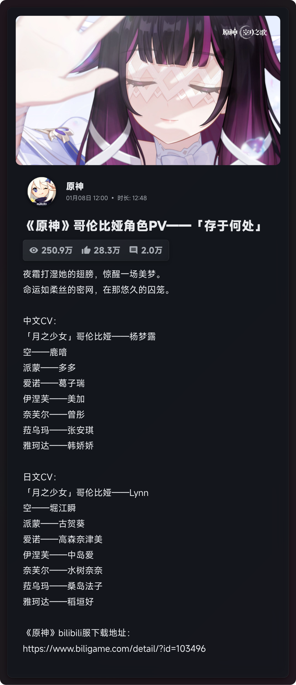<br /><b>视频解析</b></td>
    <td align="center">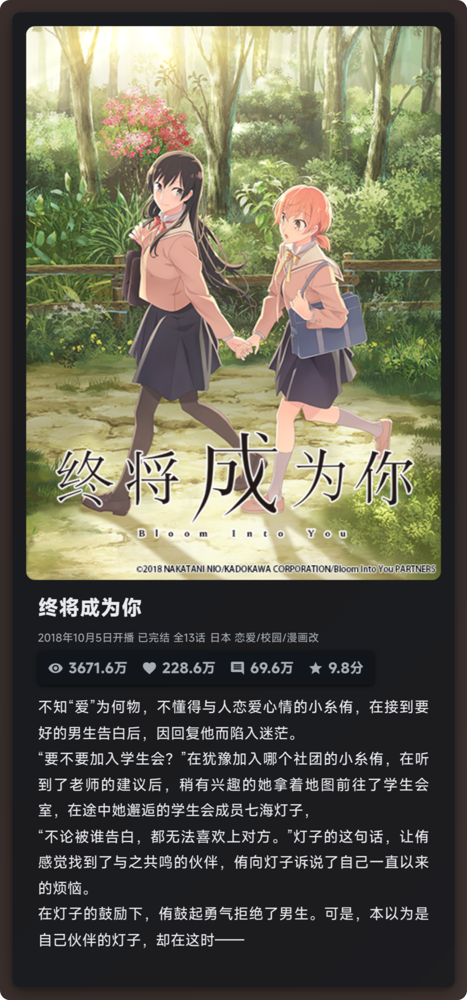<br /><b>番剧信息</b></td>
  </tr>
  <tr>
    <td align="center">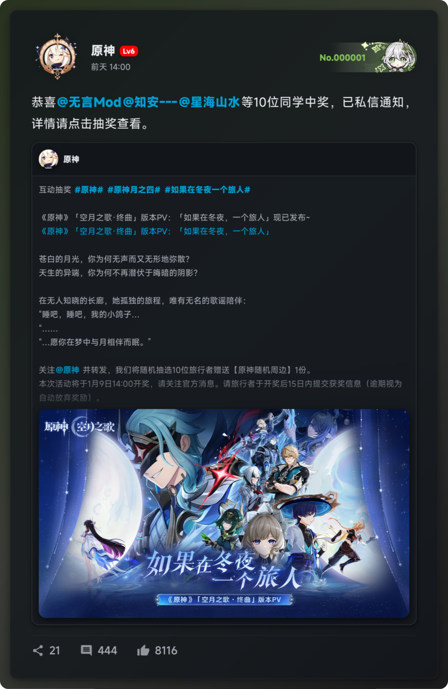<br /><b>转发动态</b></td>
    <td align="center"><br /><b>电影信息</b></td>
    <td align="center">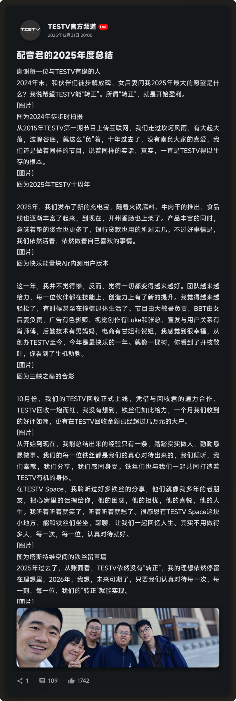<br /><b>Opus专栏</b></td>
  </tr>
</table>
</details>

## 快速部署 (Docker)

### 1. 一键部署 (Linux 推荐)

如果您是 Linux 用户，这是最简单的部署方式。脚本将自动检测环境、安装 Docker、配置 NapCat 并启动所有服务。

```bash
wget -O setup.sh https://gh-proxy.org/https://raw.githubusercontent.com/UnsplashZ/bili-qq-bot/refs/heads/main/setup.sh && chmod +x setup.sh && sudo ./setup.sh
```

**部署流程：**
1.  **环境检查**：自动安装 wget, curl, docker 等必要依赖。
2.  **配置引导**：脚本会引导您输入 Bot QQ 号，自动生成 NapCat 配置。
3.  **服务启动**：自动拉取镜像并启动容器。
4.  **扫码登录**：直接在终端显示 NapCat 日志和二维码，扫码即可完成登录。

如需开启 AI 功能或修改高级配置，请在部署完成后编辑 `config/.env` 文件（参考 [配置说明](#配置说明)），然后重启容器。

## 配置说明

本项目采用双重配置系统：`.env` 用于启动/敏感信息，`config.json` 用于运行时动态配置。

<details>
<summary><b>展开查看具体配置</b></summary>

### 1. 基础配置 (.env)
复制 `.env.example` 为 `.env`，填入 WebSocket 连接与 AI 密钥等启动参数：

| 变量名 | 说明 | 示例 / 默认值 |
| :--- | :--- | :--- |
| `WS_URL` | NapCat 的 WebSocket 地址 | `ws://napcat:3001` (Docker) / `ws://localhost:3001` (本地) |
| `NAPCAT_TEMP_PATH` | 机器人写入图片的临时路径 | `/app/.config/QQ/tmp/` |
| `NAPCAT_READ_PATH` | NapCat 读取图片的路径 (需与上条映射到同一物理路径) | `/app/.config/QQ/tmp/` |
| `AI_API_URL` | AI 接口地址 (OpenAI 兼容) | `https://api.openai.com/v1/chat/completions` |
| `AI_API_KEY` | AI 接口密钥 | `sk-xxxxxxxx` |
| `AI_MODEL` | 使用的模型名称 | `gpt-3.5-turbo` |
| `AI_PROBABILITY` | AI 随机插话概率 (0-1) | `0.1` |
| `AI_SYSTEM_PROMPT` | AI 人设提示词 | `你是一个可爱的猫娘...` |
| `AI_EMBEDDING_API_URL` | 向量嵌入接口地址 (用于记忆) | `https://api.openai.com/v1/embeddings` |
| `AI_EMBEDDING_API_KEY` | 向量嵌入密钥 (留空则同上) | `sk-xxxxxxxx` |
| `AI_CHAT_PROXY` | AI 聊天接口代理地址 (可选) | `http://127.0.0.1:7890` |
| `AI_EMBEDDING_PROXY` | AI 嵌入接口代理地址 (可选) | `http://127.0.0.1:7890` |
| `PYTHON_PATH` | Python 解释器路径 (本地开发用，Docker 默认无需配置) | `venv/bin/python` |
| `ADMIN_QQ` | 管理员 QQ 号 (用于特权指令) | `123456789` |
| `USE_BASE64_SEND` | 是否使用 Base64 发送图片 | `false` |

### 2. 动态配置 (config.json)
复制 `config/config.json.example` 为 `config/config.json`。这些配置支持热更新（通过 `/设置` 指令修改）：

| 字段名 | 说明 | 默认值 |
| :--- | :--- | :--- |
| `blacklistedQQs` | 黑名单 QQ 列表 | `[]` |
| `enabledGroups` | 允许响应的群组 (空为全部) | `[]` |
| `linkCacheTimeout` | 链接解析缓存时间 (秒) | `600` |
| `subscriptionCheckInterval` | 订阅轮询间隔 (秒) | `60` |
| `aiContextLimit` | AI 上下文保留条数 (发送给 API 的消息数) | `10` |
| `nightMode` | 深色模式配置 | `{"mode": "off", ...}` |
| `labelConfig` | 标签显示配置 | `{"video": true, ...}` |
| `showId` | 是否在卡片中显示 UID | `true` |
</details>

## 指令列表

所有指令均以 `/` 开头，部分指令仅限管理员使用。

<details>
<summary><b>展开查看完整指令列表</b></summary>

### 通用指令
| 指令 | 说明 | 作用域 | 权限 |
| :--- | :--- | :--- | :--- |
| `/菜单` / `/帮助` | 查看功能帮助菜单 (普通用户) | 当前群 | 所有人 |
| `/设置 帮助` | 查看设置帮助菜单 (管理员) | 当前群 | 所有人 |
| `/订阅列表` | 查看本群当前的订阅列表 (用户与番剧) | 当前群 | 所有人 |

### 订阅管理 (需要群管理员权限)
| 指令 | 参数 | 说明 | 作用域 |
| :--- | :--- | :--- | :--- |
| `/订阅用户` | `<UID>` | 订阅指定 UP 主的动态与直播 | **当前群** |
| `/取消订阅用户` | `<UID|用户名>` | 取消订阅指定 UP 主 | **当前群** |
| `/订阅番剧` | `<SeasonID|链接>` | 订阅番剧/影视更新 | **当前群** |
| `/取消订阅番剧` | `<SeasonID>` | 取消番剧订阅 | **当前群** |
| `/查询订阅` | `<UID>` | 立即检查某用户的订阅状态 (调试用) | **当前群** |

### 配置指令 (需要群管理员或 Root 权限)
> **注意**：以下指令在群聊中发送时，默认**仅对当前群生效**。
> 若需修改全局默认配置，请私聊 Bot 发送指令 (仅限 Root)。

| 指令 | 参数 | 说明 | 作用域 |
| :--- | :--- | :--- | :--- |
| `/设置 功能` | `<开|关> [群号]` | 开启或关闭指定群组的 Bot 响应 | Root用户可以指定群，群管仅限当前群 |
| `/设置 关注同步` | `<开|关> [B站分组]` | 开启后，将指定分组(或全部)关注列表同步为本群订阅 | **当前群** |
| `/设置 黑名单` | `<添加|移除|列表> [QQ]` | 管理黑名单。Root 操作全局黑名单，群管理员操作本群黑名单 | **当前群** / 全局 |
| `/设置 标签` | `<类型> <开|关>` | 开关左上角类型标签 (视频/番剧/动态等) | **当前群** |
| `/设置 冷却` | `<秒数>` | 设置相同链接解析冷却时间 | **当前群** |
| `/设置 显示UID` | `<开|关>` | 开关卡片中 UID 的显示 | **当前群** |
| `/设置 深色模式` | `<开|关|定时> [时间]` | 配置深色模式。定时格式如 `21:00-07:00` | **当前群** |
| `/设置 AI上下文` | `<条数>` | 设置 AI 对话记忆的上下文条数限制 | **当前群** |
| `/设置 AI概率` | `<0-1>` | 设置 AI 随机插话的概率 (0.0-1.0) | **当前群** |
| `/设置 管理员` | `<添加|移除> <QQ>` | (仅 Root) 设置本群的管理员 | **当前群** |

### 系统指令 (仅限 Root 管理员)
| 指令 | 参数 | 说明 | 作用域 |
| :--- | :--- | :--- | :--- |
| `/设置 登录` | (无) | 获取 B 站登录二维码 | **全局** |
| `/设置 验证` | `<key>` | 验证登录状态 | **全局** |
| `/设置 轮询` | `<秒数>` | 设置订阅更新的轮询间隔 | **全局** |
| `/管理 新对话` | `[群号]` | 重置指定群组的 AI 对话上下文 | 指定群 |
| `/管理 清理` | `[群号]` | 清理指定群组的配置和订阅数据 | 指定群 |
| `/管理 群列表` | (无) | 查看当前已配置的群组状态 | **全局** |

</details>

## 其他部署方式

<details>
<summary><b>本地 Docker 部署 (Git Clone)</b></summary>

如果您希望手动管理项目文件：

1.  **下载项目**
    ```bash
    git clone https://github.com/UnsplashZ/bili-qq-bot.git
    cd bili-qq-bot
    ```

2.  **配置环境**
    复制配置文件模板并进行修改：
    ```bash
    cp config/.env.example config/.env
    # 编辑 .env 文件，填入必要信息
    nano config/.env
    ```

3.  **启动服务**
    ```bash
    docker-compose up -d
    ```

4.  **查看日志与登录**
    ```bash
    docker logs -f napcat
    ```

**高级选项：**
*   **自行构建镜像**：修改 `docker-compose.yml`，注释掉 `image: ...`，取消注释 `build: .`，使用 `docker-compose up -d --build` 构建并启动。
*   **已有 NapCat**：如果您已有 NapCat 服务，可自行修改 `docker-compose.yml` ，并更新 `config/.env` 中的 `WS_URL` (如 `ws://localhost:3001`) 和 `NAPCAT_TEMP_PATH` 路径映射。

</details>

<details>
<summary><b>本地 NPM 运行</b></summary>

适用于开发调试或非 Docker 环境。

1.  **环境准备**：确保安装 Node.js (v18+), Python (v3.8+), Chrome/Chromium。
2.  **安装依赖**：克隆项目到本地后运行以下命令安装依赖，如果要使用虚拟环境，请先激活环境，并更新 `.env` 中的 `PYTHON_PATH` 为虚拟环境中的 Python 解释器路径。
    ```bash
    npm install
    pip install bilibili-api-python
    ```
3.  **配置**：同上，复制并编辑 `config/.env`。**注意**：本地运行时，请确保 `.env` 中的 `NAPCAT_TEMP_PATH` 指向宿主机真实路径，且该路径已被映射到 NapCat 容器中。
4.  **运行**：
    ```bash
    npm start
    ```
</details>

## 项目结构

*   `setup.sh`: 一键部署脚本
*   `Dockerfile` / `docker-compose.yml`: Docker 部署配置
*   `config/`:
    *   `.env`: **核心配置文件** (API Key, WS 地址等)
    *   `config.json`: 运行时动态配置 (黑名单, 自动保存)
*   `napcat/`: NapCat 配置文件与数据目录 (自动生成)
*   `logs/`: 运行日志目录
*   `data/`: 数据持久化目录
    *   `cache/`: API 数据缓存，加速解析并降低请求频率 (LRU 策略，1GB 上限)
    *   `contexts/`: AI 对话上下文历史 (每个群一个文件，最大 200MB)
    *   `vectors/`: AI 向量记忆库 (用于长期记忆检索，每个群一个文件，最大 200MB)
    *   `cookies.json`: Bilibili 登录凭证 (用于获取高清资源/会员内容)
    *   `subscriptions.json`: 订阅配置信息 (UP主/番剧/关键词监控)
    *   `subfollowers.json`: 订阅推送目标列表 (群组/用户映射关系)
*   `fonts/`: 字体文件目录 (支持热更新)
*   `src/`: 源代码
    *   `bot.js`: 程序入口，WebSocket 连接与消息分发
    *   `config.js`: 配置管理系统 (双重配置架构 + 分群覆盖)
    *   `handlers/`: 消息与 AI 处理逻辑
        *   `messageHandler.js`: 链接解析、指令系统、权限管理
        *   `aiHandler.js`: AI 对话、RAG 检索、上下文管理
    *   `services/`: B站 API, 绘图服务, 订阅服务
        *   `biliApi.js`: Bilibili API 调用 (通过 Python 子进程)
        *   `imageGenerator/`: **Puppeteer 图片生成服务** (模块化架构，17 个文件)
            *   `index.js`: 主入口，导出单例 ImageGenerator 类
            *   `core/`: 核心模块
                *   `browser.js`: Puppeteer 浏览器管理 (单例模式)
                *   `theme.js`: 主题系统 (深色/浅色模式，配色计算)
                *   `formatters.js`: 格式化工具 (时间、数字、HTML 转义)
            *   `renderers/`: 内容渲染器 (纯函数，HTML 生成)
                *   `video.js`, `bangumi.js`, `article.js`, `live.js`, `user.js`, `dynamic.js`: 各类型内容渲染
                *   `icons.js`: SVG 图标常量
                *   `components/`: 可复用组件
                    *   `richtext.js`: 富文本解析 (@用户、表情、话题)
                    *   `vote.js`: 投票卡片组件
                    *   `media.js`: 媒体 (图片/视频) 组件
            *   `generators/`: 图片生成器 (整合渲染器与浏览器)
                *   `previewCard.js`: 预览卡片生成 (6 种内容类型)
                *   `subscriptionList.js`: 订阅列表生成
                *   `helpCard.js`: 帮助卡片生成 (用户/管理员菜单)
        *   `subscriptionService.js`: 订阅轮询与推送系统
        *   `vectorMemoryService.js`: 向量嵌入与相似度检索
    *   `utils/`: 工具函数
        *   `logger.js`: 日志系统 (log4js)
        *   `cacheManager.js`: LRU 缓存管理器
        *   `designSystem.js`: 统一设计系统与主题配置
        *   `proxyUtils.js`: 代理配置工具
*   `scripts/`: Python 脚本
    *   `bili_service.py`: Bilibili API 调用服务 (基于 bilibili-api-python)

## 技术栈

### 后端技术
*   **Node.js** (v18+) - 主程序运行环境
*   **WebSocket** (`ws`) - 与 NapCat 通信
*   **Puppeteer** - 无头浏览器，生成高清预览卡片
*   **Axios** - HTTP 请求库
*   **log4js** - 日志管理

### Python 服务
*   **Python** (v3.8+) - Bilibili API 调用
*   **bilibili-api-python** - B 站接口封装库

### AI 相关
*   **OpenAI Compatible API** - 智能对话
*   **Embedding API** - 向量嵌入 (用于 RAG 检索)
*   自实现 **RAG (检索增强生成)** 系统

### 存储与缓存
*   **文件系统** (JSON) - 配置与数据持久化
*   **LRU 缓存** - 智能缓存清理策略

### 部署
*   **Docker** - 容器化部署
*   **Docker Compose** - 多容器编排

## 安全与性能

### 安全机制
*   **双层黑名单系统**: 全局黑名单 + 分群黑名单，灵活隔离恶意用户
*   **权限分级管理**: Root Admin (全局) + Group Admin (分群管理员)
*   **Prompt Injection 防御**: 用户输入自动包裹 `<user_input>` 标签，防止 AI 越狱
*   **消息文本清理**: 自动移除零宽字符、CQ 码等特殊内容

### 性能优化
*   **双层缓存架构**:
    *   **链接级缓存**: 避免短时间内重复解析同一链接 (可配置超时)
    *   **API 数据缓存**: LRU 策略，1GB 上限，加速二次访问
*   **并发控制**: 订阅检查分批处理 (10 个/批)，避免瞬时 API 压力
*   **防抖保存**: AI 上下文 1 秒延迟写入，减少磁盘 I/O
*   **智能降级**: 图片生成失败自动降级为文本链接，保证消息必达
*   **文件大小限制**: AI 上下文与向量文件限制 200MB，自动修剪过期内容
*   **懒加载**: 向量记忆按需加载，降低内存占用

## 待办计划 (Roadmap)

- [ ] 支持更多内容类型解析 (音频、合集、课程等)
- [ ] Web 管理后台 (可视化配置订阅与设置)
- [ ] 多账号登录支持 (分群使用不同 B 站账号)
- [ ] 订阅关键词监控 (监控动态中的特定关键词)
- [ ] 消息统计与数据分析
- [ ] 插件系统 (支持自定义扩展)

## 常见问题 (FAQ)

<details>
<summary><b>Q: Root 管理员和群管理员有什么区别?</b></summary>

**Root 管理员** (`.env` 中的 `ADMIN_QQ`)：
- 拥有全局最高权限
- 可以执行所有管理指令
- 可以设置/移除群管理员 (`/设置 管理员`)
- 可以修改全局配置 (如订阅轮询间隔)
- 私聊 Bot 发送指令时，修改全局默认配置

**群管理员** (`/设置 管理员` 添加)：
- 仅在指定群组拥有管理权限
- 可以管理本群的订阅、黑名单、配置等
- 无法修改全局配置
- 由 Root 管理员指定
</details>

<details>
<summary><b>Q: 如何为不同的群设置不同的配置?</b></summary>

Bot 支持**分群配置覆盖**。在群聊中发送 `/设置` 指令时，默认仅对当前群生效。例如：
- 在 A 群发送 `/设置 深色模式 定时 21:00-07:00` → 仅 A 群启用定时深色模式
- 在 B 群发送 `/设置 深色模式 关` → 仅 B 群关闭深色模式

每个群的配置独立存储在 `config.json` 的 `groupConfigs` 字段中。
</details>

<details>
<summary><b>Q: 为什么订阅列表有 120 秒冷却时间?</b></summary>

为避免频繁查询导致性能问题，`/订阅列表` 指令设有 **120 秒冷却**。如需立即查看，可等待冷却结束或使用 `/查询订阅 <UID>` 检查单个用户。
</details>

<details>
<summary><b>Q: 图片发送失败怎么办?</b></summary>

Bot 内置**智能降级机制**：
1. 优先生成图片并发送
2. 如图片发送失败，自动降级为文本链接
3. 可在 `.env` 中设置 `USE_BASE64_SEND=true` 切换为 Base64 发送模式 (兼容性更好，但可能被风控)

确保 `.env` 中的 `NAPCAT_TEMP_PATH` 和 `NAPCAT_READ_PATH` 正确映射到同一物理路径。
</details>

<details>
<summary><b>Q: AI 聊天不回复怎么办?</b></summary>

检查以下配置：
1. `.env` 中的 `AI_API_URL`, `AI_API_KEY`, `AI_MODEL` 是否正确
2. 如使用代理，检查 `AI_CHAT_PROXY` 是否配置
3. 尝试 `@机器人` 发送消息 (必定触发回复)
4. 检查 `AI_PROBABILITY` 设置 (0.1 表示 10% 概率插话)
5. 使用 `/设置 AI概率 1` 设置为 100% 回复 (测试用)
</details>

<details>
<summary><b>Q: 如何登录 B 站账号以获取高清封面?</b></summary>

1. 发送 `/设置 登录` (仅 Root 管理员)
2. Bot 会返回一个二维码图片
3. 使用 B 站 APP 扫码授权
4. 扫码后，复制返回的 `key` 值
5. 发送 `/设置 验证 <key>` 完成登录

登录后，Bot 可访问会员专属内容和高清封面。
</details>

<details>
<summary><b>Q: 订阅推送不工作?</b></summary>

检查以下项：
1. 订阅轮询间隔 (默认 60 秒)：`/设置 轮询 <秒数>`
2. 查看日志 (`logs/application.log`) 是否有错误
3. 确认已订阅用户/番剧：`/订阅列表`
4. 首次订阅只记录状态，不会立即推送，需等待下次更新
5. 使用 `/查询订阅 <UID>` 手动触发检查 (调试用)
</details>

## 致谢 (Acknowledgments)

本项目默认使用 **MiSans (小米)** 字体以获得最佳视觉体验。

特别感谢以下 AI 模型与工具在开发过程中的强力支持：

*   **Qwen**
*   **Gemini**
*   **Claude**
*   **Trae**

## 免责声明

本工具仅用于学习交流，请勿用于非法用途。Bilibili 相关接口由 `bilibili-api-python` 提供，请遵守 B 站相关规定。
